# 📘 Buku Panduan Pengguna (User Manual) — Bank Sampah Digital
> **"Solusi Cerdas untuk Masa Depan Bumi — Mengubah Sampah Menjadi Berkah dan Nilai Ekonomi"**

---

Dokumen ini merupakan panduan operasional resmi untuk website **Bank Sampah Digital**. Panduan ini disusun secara rinci dan terstruktur untuk **2 Role Utama**:
1. 👤 **Role Nasabah / Warga (`USER`)**: Panduan registrasi, pengajuan setor sampah, tracking status laporan, serta pengelolaan saldo tabungan.
2. 🛠️ **Role Pengelola / Petugas (`ADMIN`)**: Panduan monitoring dashboard 8 metrik, verifikasi fisik laporan, kalibrasi timbangan, approval otomatis kredit saldo, manajemen master data, dan audit keuangan transaksi.

File presentasi PowerPoint (.pptx) dengan desain visual lengkap, tema warna website, dan tangkapan layar telah tersedia di:
- 📊 [`User_Manual_Bank_Sampah.pptx`](./User_Manual_Bank_Sampah.pptx)
- 📊 [`Panduan_Pengguna_Bank_Sampah_Digital.pptx`](./Panduan_Pengguna_Bank_Sampah_Digital.pptx)

---

## 📑 Daftar Isi
1. [Pengenalan & Arsitektur Sistem](#1-pengenalan--arsitektur-sistem)
2. [Matriks Perbandingan Hak Akses 2 Role](#2-matriks-perbandingan-hak-akses-2-role)
3. [Akses Publik & Autentikasi (Landing, Register, Login)](#3-akses-publik--autentikasi)
4. [Panduan Lengkap Role Nasabah / Warga](#4-panduan-lengkap-role-nasabah--warga)
   - [4.1 Navigasi Dashboard & Pemantauan Saldo](#41-navigasi-dashboard--pemantauan-saldo)
   - [4.2 Langkah 1: Mengisi Formulir Setor Sampah](#42-langkah-1-mengisi-formulir-setor-sampah)
   - [4.3 Langkah 2: Mengunggah Foto Bukti Fisik Sampah](#43-langkah-2-mengunggah-foto-bukti-fisik-sampah)
   - [4.4 Langkah 3: Memantau Daftar Laporan & Arti Status](#44-langkah-3-memantau-daftar-laporan--arti-status)
   - [4.5 Langkah 4: Riwayat & Filter Status Transaksi](#45-langkah-4-riwayat--filter-status-transaksi)
   - [4.6 Langkah 5: Detail Transaksi & Saldo Bertambah](#46-langkah-5-detail-transaksi--saldo-bertambah)
5. [Panduan Lengkap Role Pengelola / Admin](#5-panduan-lengkap-role-pengelola--admin)
   - [5.1 Dashboard Eksekutif 8 Metrik & Aktivitas Terkini](#51-dashboard-eksekutif-8-metrik--aktivitas-terkini)
   - [5.2 Langkah 1: Kelola Master Data Jenis Sampah & Tarif](#52-langkah-1-kelola-master-data-jenis-sampah--tarif)
   - [5.3 Langkah 2: Kelola Master Data Wilayah Layanan DKI](#53-langkah-2-kelola-master-data-wilayah-layanan-dki)
   - [5.4 Langkah 3: Manajemen Data Pengguna (Users)](#54-langkah-3-manajemen-data-pengguna-users)
   - [5.5 Langkah 4: Memeriksa Antrean Laporan Masuk](#55-langkah-4-memeriksa-antrean-laporan-masuk)
   - [5.6 Langkah 5: Verifikasi Fisik, Kalibrasi Timbangan & Auto Kredit Saldo](#56-langkah-5-verifikasi-fisik-kalibrasi-timbangan--auto-kredit-saldo)
   - [5.7 Langkah 6: Audit Finansial & Pencarian Transaksi](#57-langkah-6-audit-finansial--pencarian-transaksi)
6. [Standar Operasional Prosedur (SOP) & Best Practice](#6-standar-operasional-prosedur-sop--best-practice)
7. [Tanya Jawab (FAQ) & Troubleshooting](#7-tanya-jawab-faq--troubleshooting)

---

## 1. Pengenalan & Arsitektur Sistem

Platform **Bank Sampah Digital** adalah aplikasi web modern berbasis **Next.js**, **Prisma ORM**, dan **PostgreSQL** yang menghubungkan warga masyarakat secara langsung dengan pengelola bank sampah.

### Alur Siklus Transaksi 5 Tahap:
```
[1. Warga Pilah Sampah] ──> [2. Buat Laporan Web & Foto] ──> [3. Admin Validasi Fisik & Timbang]
                                                                        │
[5. Rekap Transaksi Selesai] <── [4. Status APPROVED & Auto Kredit Saldo] ◄┘
```

1. **Pemilahan Sampah Mandiri**: Warga mengelompokkan sampah anorganik (plastik, kertas, kardus, logam, elektronik, kaca).
2. **Pengajuan Laporan Digital**: Warga memilih jenis sampah, wilayah pengambilan, estimasi berat, dan mengunggah foto bukti fisik.
3. **Validasi & Penimbangan**: Petugas admin memeriksa kualitas foto via Lightbox Zoom dan memasukkan berat riil timbangan.
4. **Approval & Penambahan Saldo Otomatis**: Saat admin mengubah status menjadi `APPROVED`, sistem secara otomatis mengalikan berat riil × tarif dan mendepositkan dana ke saldo tabungan nasabah.
5. **Pencatatan Transaksi**: Laporan terkonfirmasi masuk ke modul transaksi dan riwayat keuangan.

---

## 2. Matriks Perbandingan Hak Akses 2 Role

| Fitur / Modul | Role Nasabah (`USER`) | Role Pengelola (`ADMIN`) |
| :--- | :--- | :--- |
| **Tujuan Utama** | Melaporkan sampah & menabung rupiah | Memvalidasi sampah, kelola tarif & keuangan |
| **Akses Dashboard** | Menampilkan Saldo Simpanan (Rp) & 6 Laporan Terbaru | 8 Metrik Operasional & Aktivitas Real-Time |
| **Pembuatan Laporan** | ✅ Ya (Mengisi form, estimasi berat & foto) | ❌ Tidak (Fokus pada tugas verifikasi) |
| **Aksi Verifikasi** | ❌ Hanya memantau (Pending / Approved / Rejected) | ✅ Mengoreksi berat timbangan & ubah status |
| **Otomatisasi Saldo** | Menerima penambahan saldo instan saat Approved | Saldo nasabah otomatis bertambah saat status Approved |
| **Master Jenis Sampah** | 👁️ Hanya melihat nama & harga/kg aktif | ⚙️ CRUD Penuh (Tambah, Edit Tarif, Hapus) |
| **Master Wilayah** | 👁️ Memilih kecamatan domisili DKI Jakarta | ⚙️ CRUD Penuh (Tambah kecamatan / kota) |
| **Manajemen Pengguna** | ❌ Hanya mengelola profil pribadi | 👁️ Memantau seluruh daftar nasabah terdaftar |
| **Modul Transaksi** | 📜 Menu Riwayat Pribadi & Kuitansi Transaksi | 💰 Rekap Finansial Global & Pencarian Data |

---

## 3. Akses Publik & Autentikasi

### 3.1 Landing Page (Halaman Utama)
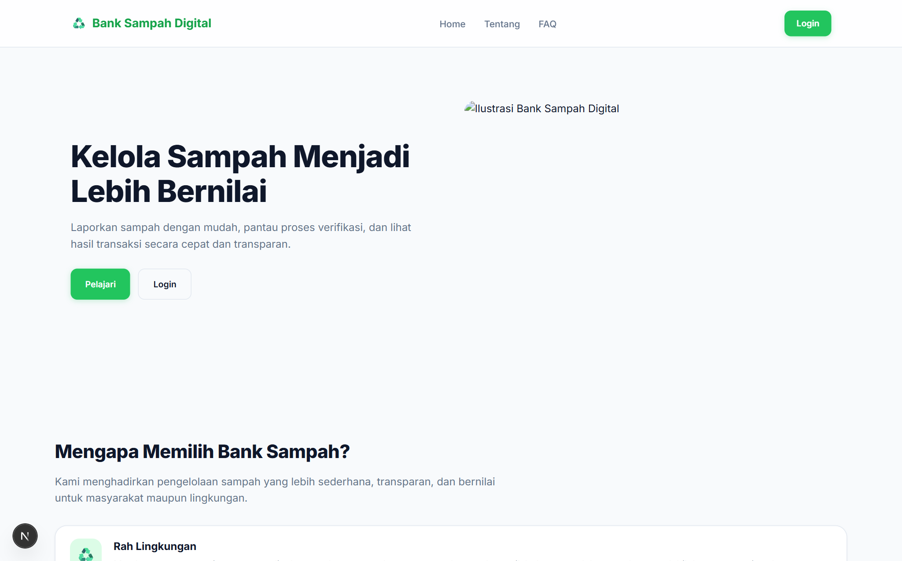

- **Akses URL**: `http://localhost:3000/`
- **Fitur Utama**:
  - Bilah navigasi lengket (*sticky navbar*) dengan pintasan menu: *Home*, *Tentang*, *FAQ*, dan tombol *Login*.
  - Edukasi 4 pilar manfaat: **Ramah Lingkungan**, **Bernilai Ekonomi**, **Proses Cepat**, dan **Data Aman**.
  - 5 Langkah cara kerja sistem untuk panduan cepat pengunjung.
  - Akordeon FAQ interaktif yang dapat dibuka-tutup.

### 3.2 Registrasi Akun Nasabah Baru
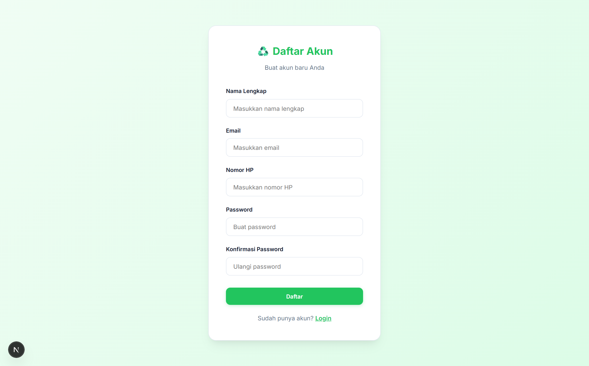

- **Akses URL**: `http://localhost:3000/register`
- **Langkah Pendaftaran**:
  1. Masukkan **Nama Lengkap** sesuai kartu identitas.
  2. Masukkan **Email Aktif** (digunakan sebagai ID login).
  3. Masukkan **Nomor Handphone / WhatsApp** aktif untuk koordinasi penjemputan sampah.
  4. Masukkan **Password** rahasia yang aman.
  5. Klik tombol **Daftar**.
- **Ketentuan Sistem**:
  - Email dan Nomor HP bersifat unik (tidak boleh duplikat).
  - Password diamankan dengan hashing bcrypt.
  - Akun baru otomatis memiliki role `USER`.

### 3.3 Login Sistem Multi-Role
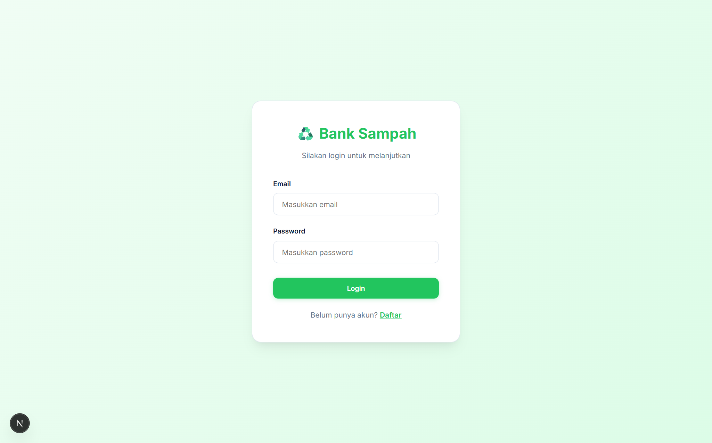

- **Akses URL**: `http://localhost:3000/login`
- **Langkah Masuk**:
  1. Masukkan email dan password yang terdaftar.
  2. Klik tombol hijau **Login**.
  3. Sistem memverifikasi kredensial via `/api/auth/login` dan menyimpan JWT cookie HTTP-only.
- **Pengalihan Otomatis (*Auto-Redirect*)**:
  - Nasabah (`role: USER`) $\rightarrow$ Dialihkan ke `/user/dashboard`.
  - Pengelola (`role: ADMIN`) $\rightarrow$ Dialihkan ke `/admin/dashboard`.

---

## 4. Panduan Lengkap Role Nasabah / Warga

### 4.1 Navigasi Dashboard & Pemantauan Saldo
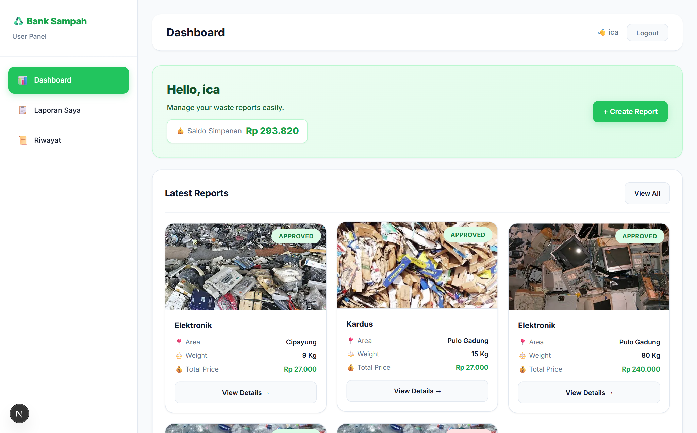

Setelah berhasil login, nasabah disambut di halaman `/user/dashboard`.

1. **Kartu Saldo Simpanan (Rp)**:
   - Menampilkan total akumulasi tabungan rupiah dari seluruh laporan yang telah berstatus `APPROVED`.
   - Saldo ini dihitung otomatis oleh sistem database.
2. **Tombol "+ Create Report"**:
   - Pintasan langsung untuk membuka formulir penyetoran sampah baru.
3. **Kartu Laporan Terbaru**:
   - Menampilkan hingga 6 laporan terkini lengkap dengan foto, jenis sampah, wilayah, berat timbangan, total taksiran harga, dan lencana status.

---

### 4.2 Langkah 1: Mengisi Formulir Setor Sampah
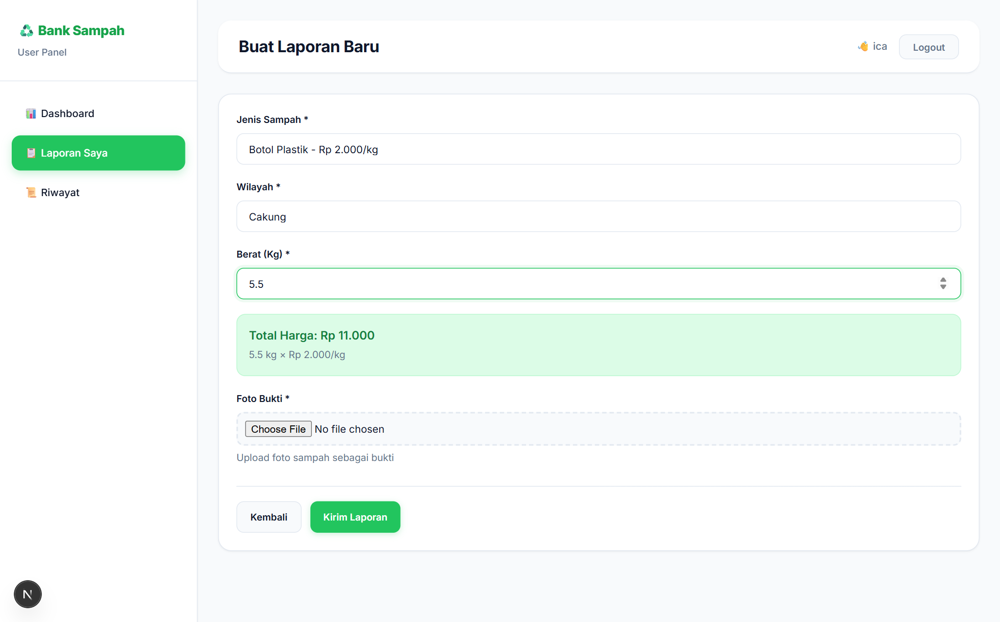

- **Akses URL**: `http://localhost:3000/user/laporan/create`
- **Langkah Pengisian**:
  1. **Pilih Jenis Sampah**: Klik dropdown untuk memilih komoditas daur ulang (misal: *Botol Plastik - Rp 2.000/kg*, *Kardus - Rp 1.800/kg*, *Logam - Rp 5.000/kg*).
  2. **Pilih Wilayah**: Pilih kecamatan domisili Anda di DKI Jakarta (telah dikelompokkan berdasarkan Jakarta Pusat, Barat, Selatan, Timur, Utara).
  3. **Input Berat (Kg)**: Masukkan estimasi berat sampah dalam satuan kilogram (contoh: `5.5`).
  4. **Kalkulasi Total Otomatis**: Kotak hijau secara otomatis menghitung estimasi pendapatan:
     $$\text{Total Harga} = \text{Berat (Kg)} \times \text{Tarif per Kg}$$

---

### 4.3 Langkah 2: Mengunggah Foto Bukti Fisik Sampah


1. Pada bagian **Foto Bukti \***, klik tombol unggah berkas (*Choose File*).
2. Pilih foto sampah yang telah dipilah dari galeri atau kamera HP Anda.
3. **Pratinjau Foto Real-Time**: Sistem langsung menampilkan gambar mini (*thumbnail*) foto yang dipilih untuk memastikan gambar tidak salah.
4. Klik tombol **Kirim Laporan**.
5. Tunggu proses upload selesai. Sistem memunculkan alert *"Laporan berhasil dibuat!"* dan mengarahkan Anda ke daftar laporan.

---

### 4.4 Langkah 3: Memantau Daftar Laporan & Arti Status
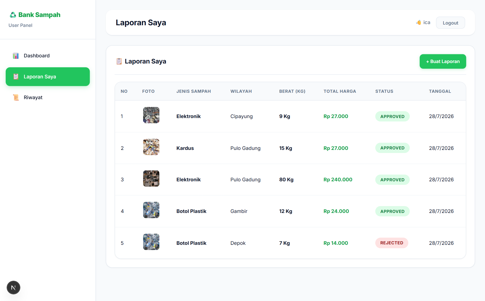

- **Akses URL**: `http://localhost:3000/user/laporan`
- Pada halaman ini, nasabah dapat memantau status verifikasi seluruh sampah yang pernah diajukan.

#### Arti 3 Lencana Status:
- ⏳ <span style="background:#FEF3C7;color:#92400E;padding:3px 8px;border-radius:10px;font-weight:bold;">PENDING</span>: Laporan baru terkirim dan berada dalam antrean pemeriksaan petugas.
- ✅ <span style="background:#DCFCE7;color:#15803D;padding:3px 8px;border-radius:10px;font-weight:bold;">APPROVED</span>: Laporan dinyatakan valid oleh admin! Berat telah dikonfirmasi dan saldo rupiah telah ditambahkan ke akun Anda.
- ❌ <span style="background:#FEE2E2;color:#991B1B;padding:3px 8px;border-radius:10px;font-weight:bold;">REJECTED</span>: Laporan ditolak (misalnya foto tidak jelas, sampah tercampur zat berbahaya/organik).

---

### 4.5 Langkah 4: Riwayat & Filter Status Transaksi
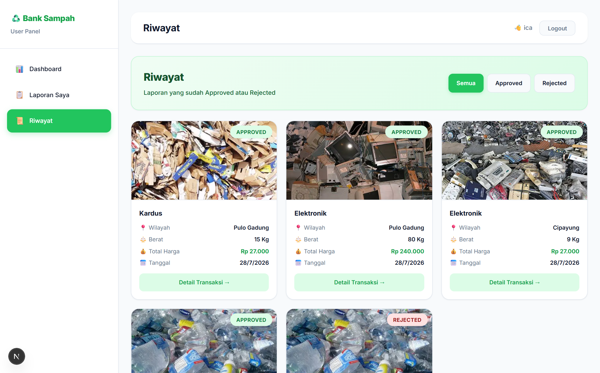

- **Akses URL**: `http://localhost:3000/user/riwayat`
- Berfungsi sebagai buku tabungan digital nasabah yang menampung laporan yang telah diproses final.
- **Fitur Tab Filter**:
  - **Semua**: Menampilkan gabungan seluruh laporan approved dan rejected.
  - **Approved**: Menampilkan hanya transaksi berhasil yang menghasilkan pundi rupiah.
  - **Rejected**: Menampilkan transaksi yang ditolak untuk bahan evaluasi.

---

### 4.6 Langkah 5: Detail Transaksi & Saldo Bertambah
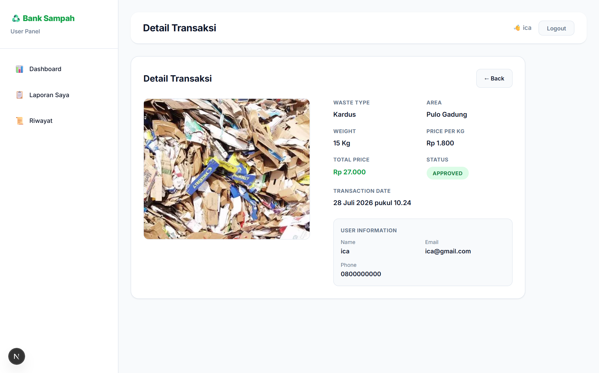

- **Akses URL**: `http://localhost:3000/user/riwayat/[id]`
- Menampilkan rincian nota transaksi digital:
  - Jenis sampah & harga per kilogram saat transaksi terjadi.
  - Berat terverifikasi hasil penimbangan petugas.
  - Total pendapatan bersih yang masuk ke saldo.
  - Tanggal dan jam penyelesaian transaksi.
  - **Fitur Lightbox**: Klik foto bukti sampah untuk memperbesar foto dalam resolusi penuh (*full size*).

---

## 5. Panduan Lengkap Role Pengelola / Admin

### 5.1 Dashboard Eksekutif 8 Metrik & Aktivitas Terkini
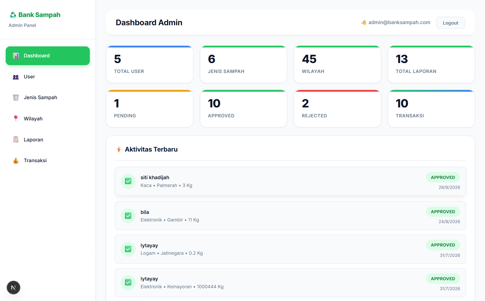

- **Akses URL**: `http://localhost:3000/admin/dashboard`
- **8 Indikator Metrik Operasional**:
  1. **Total User**: Jumlah nasabah terdaftar.
  2. **Jenis Sampah**: Jumlah komoditas daur ulang aktif.
  3. **Wilayah**: Jumlah kecamatan operasional bank sampah.
  4. **Total Laporan**: Akumulasi seluruh laporan yang masuk.
  5. **Pending**: Antrean laporan yang membutuhkan verifikasi segera.
  6. **Approved**: Laporan yang telah berhasil diverifikasi.
  7. **Rejected**: Laporan yang ditolak.
  8. **Transaksi**: Total transaksi sukses yang bernilai finansial.
- **Feed Aktivitas Terbaru**: Memperlihatkan laporan masuk secara *live* dengan ikon status dinamis.

---

### 5.2 Langkah 1: Kelola Master Data Jenis Sampah & Tarif
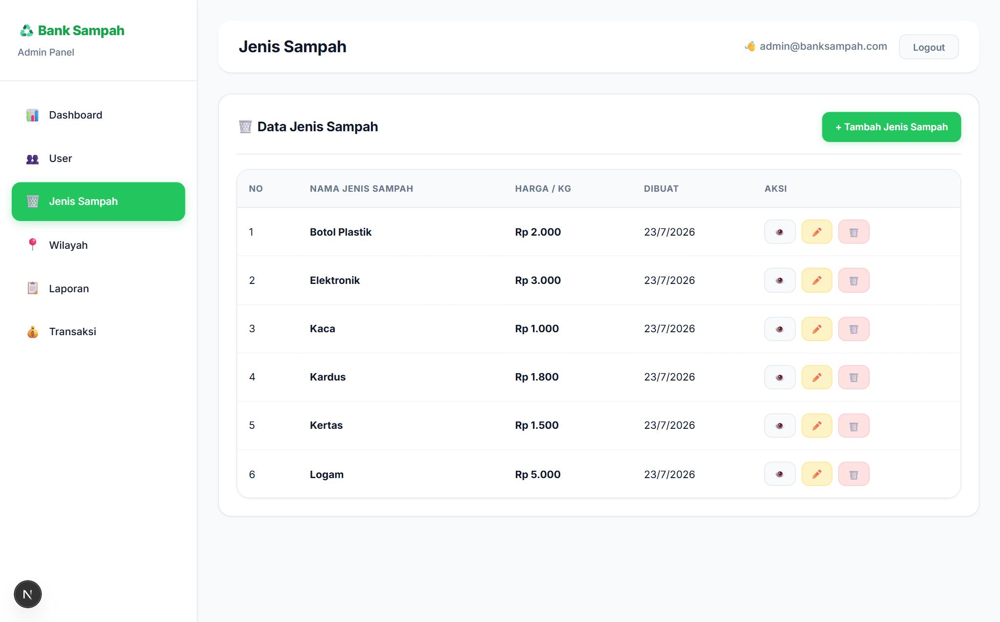

- **Akses URL**: `http://localhost:3000/admin/jenis-sampah`
- **Aksi Operasional Admin**:
  - **Tambah Komoditas Baru**: Klik `+ Tambah Jenis Sampah` (`/admin/jenis-sampah/create`), isi nama jenis sampah dan harga beli per kilogram (misal: *Aluminium Kaleng - Rp 8.500*).
  - **Perbarui Harga Pasar**: Klik tombol ✏️ Edit untuk menyesuaikan perubahan harga pengepul industri.
  - **Hapus Data**: Klik tombol 🗑️ Hapus pada kategori yang sudah tidak diterima.

---

### 5.3 Langkah 2: Kelola Master Data Wilayah Layanan DKI
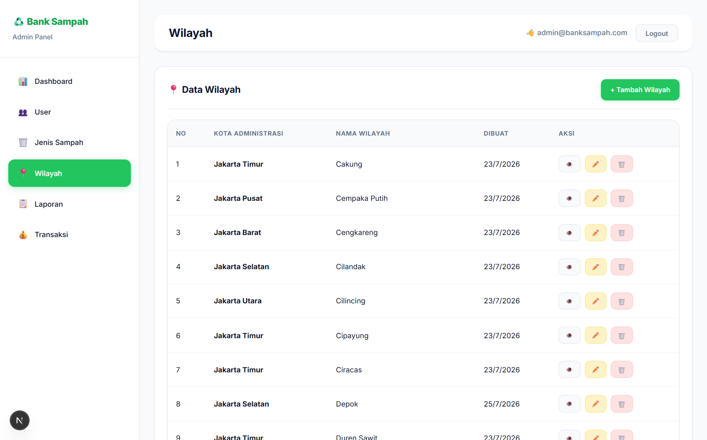

- **Akses URL**: `http://localhost:3000/admin/wilayah`
- Mengatur cakupan operasional bank sampah di 5 Kota Administrasi DKI Jakarta.
- Admin dapat menambahkan kecamatan baru atau memperluas zonasi layanan sehingga warga di area baru dapat memilih lokasinya saat membuat laporan.

---

### 5.4 Langkah 3: Manajemen Data Pengguna (Users)
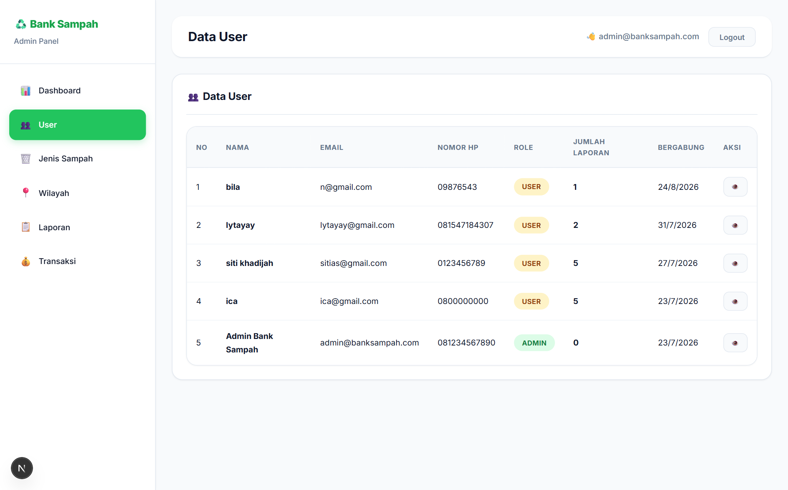

- **Akses URL**: `http://localhost:3000/admin/users`
- **Fasilitas Pemantauan**:
  - Melihat seluruh profil nasabah (Nama, Email, No. HP/WhatsApp, Role, dan Tanggal Registrasi).
  - Kolom **Jumlah Laporan** menunjukkan tingkat keaktifan partisipasi setiap nasabah dalam program bank sampah.
  - Tombol 👁️ untuk meninjau profil mendalam pengguna.

---

### 5.5 Langkah 4: Memeriksa Antrean Laporan Masuk
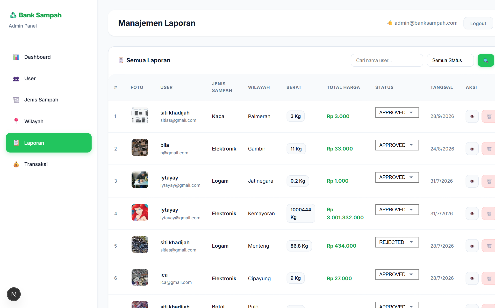

- **Akses URL**: `http://localhost:3000/admin/laporan`
- Menampilkan seluruh kiriman laporan masuk dari seluruh nasabah secara terpusat.
- Petugas dapat melihat ringkasan: foto sampah, nama penyetor, jenis sampah, wilayah, estimasi berat, total taksiran harga, dan status.
- Klik tombol **Detail** pada baris laporan yang berstatus `PENDING` untuk masuk ke lembar kerja verifikasi.

---

### 5.6 Langkah 5: Verifikasi Fisik, Kalibrasi Timbangan & Auto Kredit Saldo
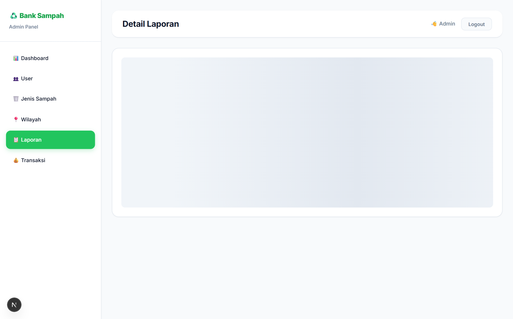

- **Akses URL**: `http://localhost:3000/admin/laporan/[id]`
- **SOP Verifikasi 3 Langkah**:
  1. **Inspeksi Foto Bukti**: Klik foto sampah untuk membuka fitur **Lightbox Zoom**. Pastikan sampah benar-benar sesuai dengan kategori yang dipilih dan dalam kondisi kering serta bersih.
  2. **Koreksi Berat Timbangan Riil**: Ubah nilai pada kolom `Berat (Kg)` sesuai dengan hasil penimbangan timbangan fisik di lapangan. Sistem langsung mengalkulasi ulang total harga secara real-time.
  3. **Eksekusi Status & Saldo Otomatis**:
     - Pilih opsi status **APPROVED**: Sistem **OTOMATIS MENAMBAHKAN SALDO** ke akun nasabah sebesar:
       $$\Delta \text{Saldo} = \text{Berat Riil} \times \text{Harga per Kg}$$
     - Pilih opsi status **REJECTED**: Jika sampah tidak memenuhi kriteria daur ulang.
  4. Klik tombol **Update Laporan**.

---

### 5.7 Langkah 6: Audit Finansial & Pencarian Transaksi
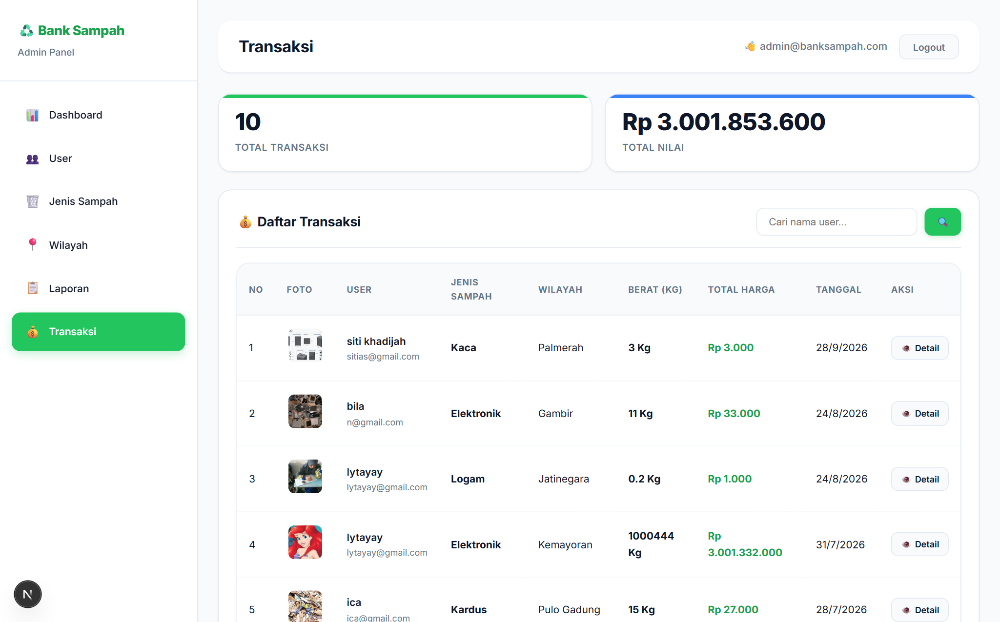

- **Akses URL**: `http://localhost:3000/admin/transaksi`
- **Fasilitas Audit Finansial**:
  - **Metrik Total Nilai**: Menampilkan total perputaran rupiah yang telah disalurkan bank sampah kepada masyarakat.
  - **Pencarian Cepat**: Masukkan nama nasabah pada kotak pencarian untuk menemukan seluruh transaksi individu dalam hitungan detik.
  - **Tombol Detail Transaksi**: Menampilkan kuitansi transaksi lengkap (`/admin/transaksi/[id]`) untuk pembukuan kas bank sampah.

---

## 6. Standar Operasional Prosedur (SOP) & Best Practice

### SOP Untuk Nasabah / Warga
1. **Pilah Sejak dari Rumah**: Pisahkan sampah berdasarkan jenisnya (kertas, kardus, botol plastik, logam).
2. **Bersihkan & Keringkan**: Buang sisa cairan pada botol atau sisa makanan pada kemasan sebelum ditimbang.
3. **Pencahayaan Foto Cukup**: Ambil foto di ruangan atau area terbuka yang terang agar kondisi fisik sampah terlihat jelas.
4. **Pengecekan Saldo Berkala**: Pastikan saldo bertambah setelah status laporan dinyatakan `APPROVED`.

### SOP Untuk Pengelola / Admin
1. **Pemeriksaan Rutin**: Cek antrean laporan `PENDING` minimal dua kali sehari (pagi dan sore).
2. **Gunakan Lightbox**: Selalu periksa foto ukuran penuh untuk mendeteksi adanya kontaminasi sampah.
3. **Akurasi Timbangan Lapangan**: Pastikan timbangan fisik telah ditera/dikalibrasi secara berkala.
4. **Kesesuaian Harga**: Selalu perbarui harga beli jenis sampah di sistem jika terdapat perubahan harga dari pabrik daur ulang.

---

## 7. Tanya Jawab (FAQ) & Troubleshooting

**Q1: Mengapa saldo simpanan saya belum bertambah setelah mengirim laporan?**  
> *Jawaban:* Saldo hanya akan bertambah secara otomatis setelah laporan berstatus `APPROVED`. Jika masih `PENDING`, laporan Anda sedang dalam proses verifikasi oleh petugas.

**Q2: Mengapa laporan saya berstatus REJECTED?**  
> *Jawaban:* Laporan ditolak umumnya disebabkan oleh foto bukti yang buram, sampah yang bercampur dengan sampah organik basah/kotor, atau jenis sampah yang tidak sesuai dengan kategori yang dipilih.

**Q3: Bagaimana cara mencairkan saldo yang ada di akun saya?**  
> *Jawaban:* Saldo di website merupakan tabungan digital resmi Anda. Anda dapat mencairkannya menjadi uang tunai atau transfer rekening melalui petugas kasir saat jadwal operasional penimbangan rutin di bank sampah unit wilayah Anda.

**Q4: Apakah admin bisa mengoreksi berat jika nasabah salah memasukkan estimasi berat?**  
> *Jawaban:* Ya. Admin memiliki hak penuh untuk mengoreksi angka berat timbangan di halaman detail laporan sebelum melakukan persetujuan (`APPROVED`). Total harga akan disesuaikan otomatis.

---

*Buku Panduan Pengguna ini dibuat untuk sistem Bank Sampah Digital v1.0 (2026).*
